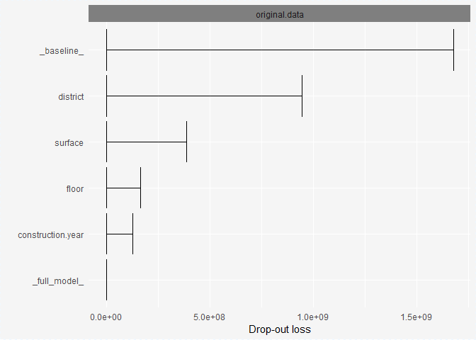
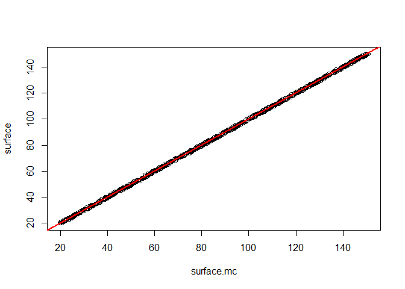
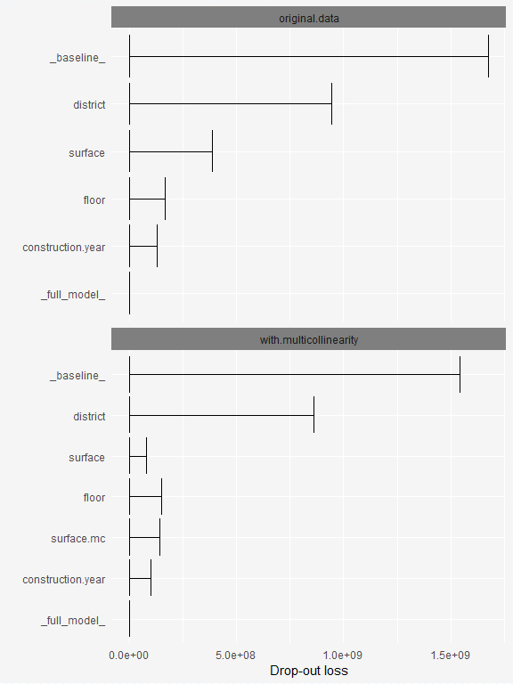

# permutation importance in the case with multicollinearity

according to:

https://explained.ai/rf-importance/index.html

# 1st model 


```r
data(apartments, package = "DALEX")
learner.rf <- makeLearner("regr.randomForest", par.vals = list(ntree = 1000, mtry = 3))

apartments$no.rooms <- NULL
task.1  <- makeRegrTask(id = "ap", data = apartments,    target = "m2.price")
model.1 <- train(learner.rf, task.1)
```

## build explainer with custom predict() for mlr

```r
predictMLR <- function(object, newdata) {
  pred <- predict(object, newdata=newdata)
  response <- pred$data$response
  return(response)
}
```

## Variable importance


```r
explainer.1 <-  explain(model = model.1, 
                        label = "original.data",
                        data  = apartments %>% select(-m2.price), 
                        y     = apartments$m2.price,
                        predict_function = predictMLR)

vi.1 <- variable_importance(explainer     = explainer.1,
                            type          = "difference")

plot(vi.1)
```

<!-- -->


# second model with multicollinearity


```r
apartments.mc <- apartments %>% mutate(surface.mc = jitter(surface, amount = 1))
apartments.mc %>% str()
```

```
'data.frame':	1000 obs. of  6 variables:
 $ m2.price         : num  5897 1818 3643 3517 3013 ...
 $ construction.year: num  1953 1992 1937 1995 1992 ...
 $ surface          : num  25 143 56 93 144 61 127 105 145 112 ...
 $ floor            : int  3 9 1 7 6 6 8 8 6 9 ...
 $ district         : Factor w/ 10 levels "Bemowo","Bielany",..: 6 2 5 4 3 6 3 7 6 6 ...
 $ surface.mc       : num  25.4 143.7 55.6 93.2 143.1 ...
```

```r
print(mc.lm <- lm(surface ~ surface.mc, data = apartments.mc))
```

```

Call:
lm(formula = surface ~ surface.mc, data = apartments.mc)

Coefficients:
(Intercept)   surface.mc  
     -0.026        1.000  
```

```r
plot(surface ~ surface.mc, data = apartments.mc)
abline(mc.lm, col="red",lwd=2)
```

<!-- -->


```r
task.2  <- makeRegrTask(id = "ap", data = apartments.mc, target = "m2.price")
model.2 <- train(learner.rf, task.2)

explainer.2 <-  explain(model = model.2, 
                        label = "with.multicollinearity",
                        data  = apartments.mc %>% select(-m2.price), 
                        y     = apartments.mc$m2.price,
                        predict_function = predictMLR)
```


# Variable importance comparison


```r
vi.2 <- variable_importance(explainer     = explainer.2,
                            type          = "difference")

DALEX:::plot.variable_importance_explainer(vi.1, vi.2)
```

<!-- -->
