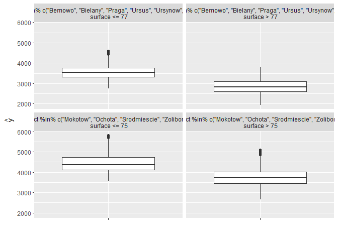

# read mlr models

regression task for apartments dataset.


```r
tuned.model <- readRDS("./tuned_models.RDS")
# tuned.model %>% str(2)
```


# iml + mlr

according to:

https://www.r-bloggers.com/interpretable-machine-learning-with-iml-and-mlr/


# build predictor

## simple


```r
require("iml")
# X = Boston[which(names(Boston) != "medv")]
require(DALEX)
```

```
Loading required package: DALEX
```

```
Welcome to DALEX (version: 0.2.6).
```

```

Attaching package: 'DALEX'
```

```
The following object is masked from 'package:dplyr':

    explain
```

```r
data("apartmentsTest", package = "DALEX")
X = apartmentsTest %>% select(-m2.price)
Y = apartmentsTest$m2.price

predictor.rf <- Predictor$new(tuned.model[["rf"]], data = X, y = Y)
```


## multiple predictor


```r
model.labels <- names(tuned.model)
predictor    <- list()

for(model.name in model.labels){
  predictor[[model.name]] <- Predictor$new(tuned.model[[model.name]], data = X, y = Y)
}
```


# Groval surrogate model

Another way to make the models more interpretable is to replace the black box with a simpler model ??? a decision tree. We take the predictions of the black box model (in our case the random forest) and train a decision tree on the original features and the predicted outcome.
The plot shows the terminal nodes of the fitted tree.
The maxdepth parameter controls how deep the tree can grow and therefore how interpretable it is.


```r
tree = TreeSurrogate$new(predictor.rf, maxdepth = 2)
plot(tree)
```

<!-- -->
