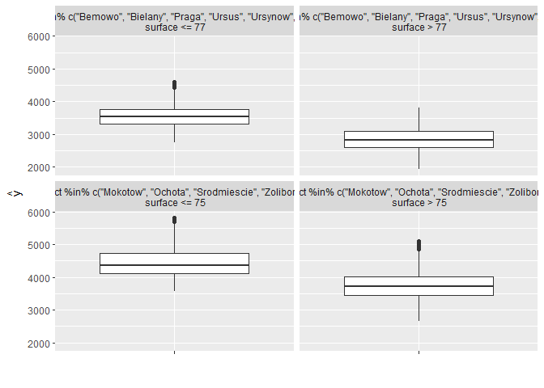

# read mlr models

regression task for apartments dataset.


```r
tuned.model <- readRDS("./tuned_models.RDS")
# tuned.model %>% str(2)
```


# iml + mlr

according to:

https://www.r-bloggers.com/interpretable-machine-learning-with-iml-and-mlr/


# build predictor

## simple


```r
require("iml")
# X = Boston[which(names(Boston) != "medv")]
require(DALEX)
```

```
Loading required package: DALEX
```

```
Welcome to DALEX (version: 0.2.6).
```

```

Attaching package: 'DALEX'
```

```
The following object is masked from 'package:dplyr':

    explain
```

```r
data("apartmentsTest", package = "DALEX")
X = apartmentsTest %>% select(-m2.price)
Y = apartmentsTest$m2.price

predictor.rf <- Predictor$new(tuned.model[["rf"]], data = X, y = Y)
```


## multiple predictor


```r
model.labels <- names(tuned.model)
predictor    <- list()

for(model.name in model.labels){
  predictor[[model.name]] <- Predictor$new(tuned.model[[model.name]], data = X, y = Y)
}
```


# Groval surrogate model

Another way to make the models more interpretable is to replace the black box with a simpler model ??? a decision tree. We take the predictions of the black box model (in our case the random forest) and train a decision tree on the original features and the predicted outcome.
The plot shows the terminal nodes of the fitted tree.
The maxdepth parameter controls how deep the tree can grow and therefore how interpretable it is.


```r
tree = TreeSurrogate$new(predictor.rf, maxdepth = 2)
plot(tree)
```

<!-- -->

# Explain single predictions with a local model

Global surrogate model can improve the understanding of the global model behaviour.
We can also fit a model locally to understand an individual prediction better. The local model fitted by LocalModel is a linear regression model and the data points are weighted by how close they are to the data point for wich we want to explain the prediction.

https://rawgit.com/pbiecek/DALEX_docs/master/vignettes/Comparison_between_breakdown%2C_lime%2C_shapley.html


```r
lime.explain <- LocalModel$new(predictor.rf, x.interest = X[1,])
lime.explain$results
```

```
                          beta x.recoded    effect  x.original
surface               -4.12954       131 -540.9698         131
no.rooms             -23.77202         5 -118.8601           5
district=Srodmiescie 555.54838         1  555.5484 Srodmiescie
                                  feature        feature.value
surface                           surface          surface=131
no.rooms                         no.rooms           no.rooms=5
district=Srodmiescie district=Srodmiescie district=Srodmiescie
```


```r
plot(lime.explain)
```

<!-- -->


```r
lime <- plime <- list()

for(model.name in model.labels){
  lime[[model.name]]  <- LocalModel$new(predictor[[model.name]], x.interest = X[10,])
  plime[[model.name]] <- plot(lime[[model.name]]) + labs(tag = model.name)
}

gridExtra::grid.arrange(grobs = plime, ncol=2)
```

<!-- -->


# Explain single predictions with game theory

An alternative for explaining individual predictions is a method from coalitional game theory named Shapley value.
Assume that for one data point, the feature values play a game together, in which they get the prediction as a payout. The Shapley value tells us how to fairly distribute the payout among the feature values.


```r
shapley <- Shapley$new(predictor.rf, x.interest = X[10,])
plot(shapley)
```

<!-- -->


```r
set.seed(8)
shap <- pshap <- list()

for(model.name in model.labels){
  shap[[model.name]]  <- Shapley$new(predictor[[model.name]], x.interest = X[10,])
  pshap[[model.name]] <- plot(shap[[model.name]], sort=FALSE) + labs(tag = model.name)
}

gridExtra::grid.arrange(grobs = pshap, ncol=2)
```

<!-- -->


default sample size of Shapley is 100. This size sometimes cause degradation of estimated accuracy.


```r
set.seed(1)
shapley.1 <- Shapley$new(predictor[["enet"]], x.interest = X[10,])
p1 <- plot(shapley.1, sort=FALSE)

set.seed(8)
shapley.2 <- Shapley$new(predictor[["enet"]], x.interest = X[10,])
p2 <- plot(shapley.2, sort=FALSE)

gridExtra::grid.arrange(p1, p2, ncol=2)
```

<!-- -->

More sample size, more accurate (but the estimation becomes slower).


```r
set.seed(1)
shapley.1 <- Shapley$new(predictor[["enet"]], x.interest = X[10,], sample.size = 100 * 10)
p1 <- plot(shapley.1, sort=FALSE)

set.seed(8)
shapley.2 <- Shapley$new(predictor[["enet"]], x.interest = X[10,], sample.size = 100 * 10)
p2 <- plot(shapley.2, sort=FALSE)

gridExtra::grid.arrange(p1, p2, ncol=2)
```

<!-- -->
