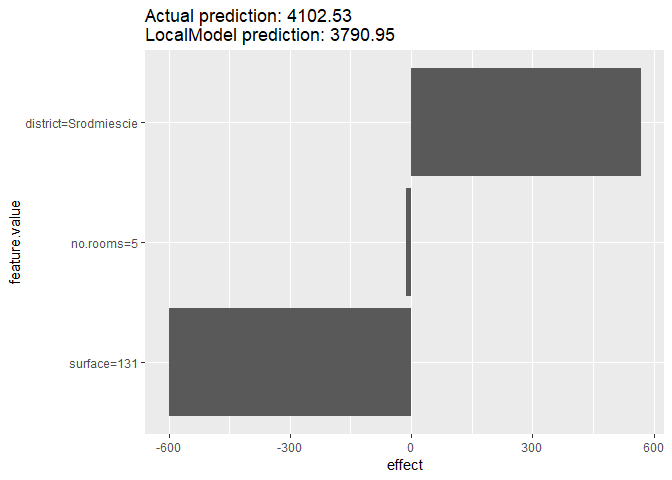
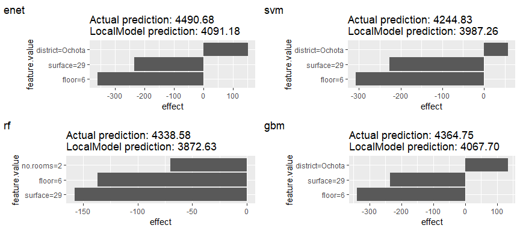
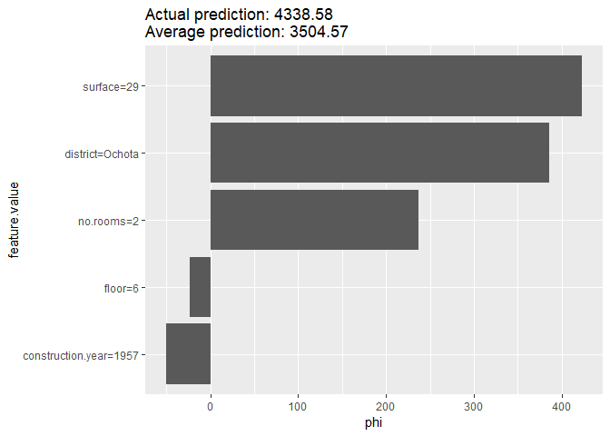
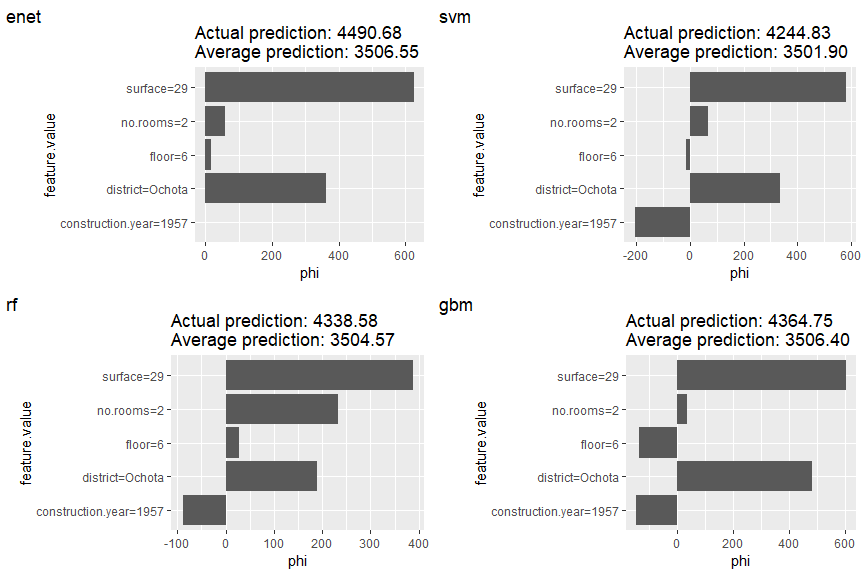
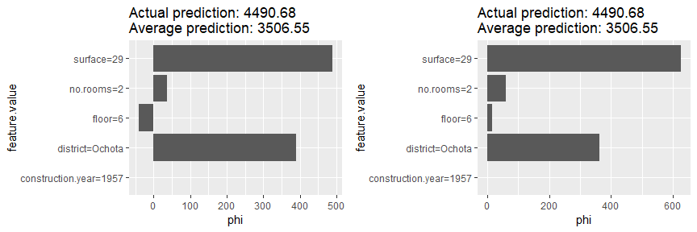
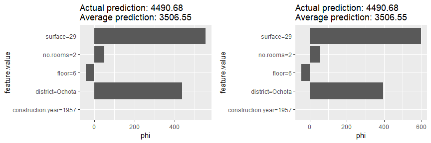

# read mlr models

regression task for apartments dataset.


```r
tuned.model <- readRDS("./tuned_models.RDS")
# tuned.model %>% str(2)
```


# iml + mlr

according to:

https://www.r-bloggers.com/interpretable-machine-learning-with-iml-and-mlr/


# build predictor

## simple


```r
require("iml")
# X = Boston[which(names(Boston) != "medv")]
require(DALEX)
```

```
Loading required package: DALEX
```

```
Welcome to DALEX (version: 0.2.6).
```

```

Attaching package: 'DALEX'
```

```
The following object is masked from 'package:dplyr':

    explain
```

```r
data("apartmentsTest", package = "DALEX")
X = apartmentsTest %>% select(-m2.price)
Y = apartmentsTest$m2.price

predictor.rf <- Predictor$new(tuned.model[["rf"]], data = X, y = Y)
```


## multiple predictor


```r
model.labels <- names(tuned.model)
predictor    <- list()

for(model.name in model.labels){
  predictor[[model.name]] <- Predictor$new(tuned.model[[model.name]], data = X, y = Y)
}
```


# Explain single predictions with a local model

Global surrogate model can improve the understanding of the global model behaviour.
We can also fit a model locally to understand an individual prediction better. The local model fitted by LocalModel is a linear regression model and the data points are weighted by how close they are to the data point for wich we want to explain the prediction.

https://rawgit.com/pbiecek/DALEX_docs/master/vignettes/Comparison_between_breakdown%2C_lime%2C_shapley.html


```r
lime.explain <- LocalModel$new(predictor.rf, x.interest = X[1,])
lime.explain$results
```

```
                           beta x.recoded     effect  x.original
surface               -4.579322       131 -599.89123         131
no.rooms              -2.538297         5  -12.69148           5
district=Srodmiescie 568.030712         1  568.03071 Srodmiescie
                                  feature        feature.value
surface                           surface          surface=131
no.rooms                         no.rooms           no.rooms=5
district=Srodmiescie district=Srodmiescie district=Srodmiescie
```


```r
plot(lime.explain)
```

<!-- -->


```r
lime <- plime <- list()

for(model.name in model.labels){
  lime[[model.name]]  <- LocalModel$new(predictor[[model.name]], x.interest = X[10,])
  plime[[model.name]] <- plot(lime[[model.name]]) + labs(tag = model.name)
}

gridExtra::grid.arrange(grobs = plime, ncol=2)
```

<!-- -->


# Explain single predictions with game theory

An alternative for explaining individual predictions is a method from coalitional game theory named Shapley value.
Assume that for one data point, the feature values play a game together, in which they get the prediction as a payout. The Shapley value tells us how to fairly distribute the payout among the feature values.


```r
shapley <- Shapley$new(predictor.rf, x.interest = X[10,])
plot(shapley)
```

<!-- -->


```r
set.seed(8)
shap <- pshap <- list()

for(model.name in model.labels){
  shap[[model.name]]  <- Shapley$new(predictor[[model.name]], x.interest = X[10,])
  pshap[[model.name]] <- plot(shap[[model.name]], sort=FALSE) + labs(tag = model.name)
}

gridExtra::grid.arrange(grobs = pshap, ncol=2)
```

<!-- -->


default sample size of Shapley is 100. This size sometimes cause degradation of estimated accuracy.


```r
set.seed(1)
shapley.1 <- Shapley$new(predictor[["enet"]], x.interest = X[10,])
p1 <- plot(shapley.1, sort=FALSE)

set.seed(8)
shapley.2 <- Shapley$new(predictor[["enet"]], x.interest = X[10,])
p2 <- plot(shapley.2, sort=FALSE)

gridExtra::grid.arrange(p1, p2, ncol=2)
```

<!-- -->

More sample size, more accurate (but the estimation becomes slower).


```r
set.seed(1)
shapley.1 <- Shapley$new(predictor[["enet"]], x.interest = X[10,], sample.size = 100 * 10)
p1 <- plot(shapley.1, sort=FALSE)

set.seed(8)
shapley.2 <- Shapley$new(predictor[["enet"]], x.interest = X[10,], sample.size = 100 * 10)
p2 <- plot(shapley.2, sort=FALSE)

gridExtra::grid.arrange(p1, p2, ncol=2)
```

<!-- -->
