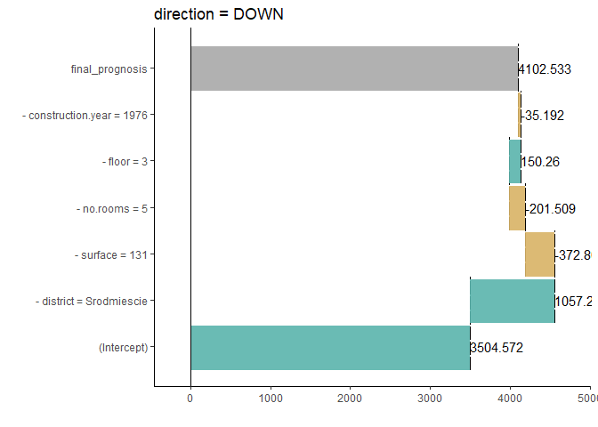
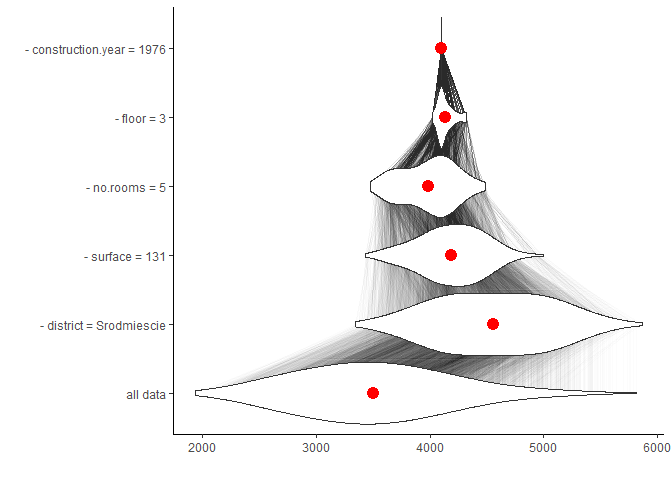
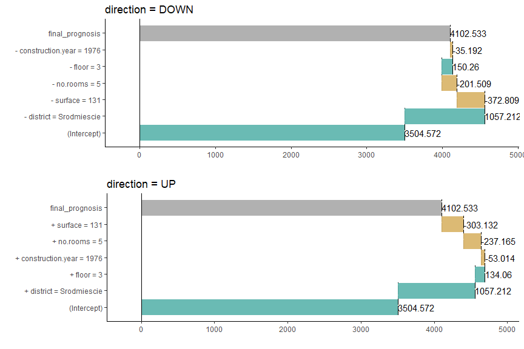
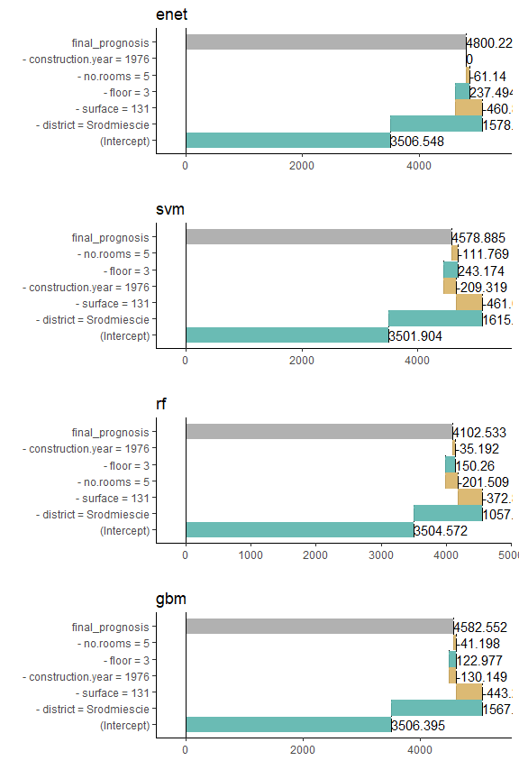

# load mlr models

regression task for apartments dataset.


```r
tuned.model <- readRDS("./tuned_models.RDS")
# tuned.model %>% str(2)
```

# breakDown + mlr

according to:

https://rawgit.com/pbiecek/DALEX_docs/master/vignettes/Comparison_between_breakdown%2C_lime%2C_shapley.html


## custom predict()

For the models created by mlr package we have to provide custom predict function which takes two arguments: model and newdata and returns a numeric vector with predictions because function predict() from mlr returns not only predictions but an object with more information.


```r
predictMLR <- function(object, newdata) {
  pred <- predict(object, newdata=newdata)
  response <- pred$data$response
  return(response)
}
```

## simple plot


```r
require(breakDown)
```

```
Loading required package: breakDown
```

```r
data("apartmentsTest", package = "DALEX")
X <- apartmentsTest[,-1]

target <- 1

br.down.rf <- broken(
  model = tuned.model[["rf"]], 
  data  = X,
  new_observation = X[target, ], 
  direction = "down",
  predict.function = predictMLR,
  keep_distributions=TRUE)

pbr.down.rf <- plot(br.down.rf) + ggtitle("direction = DOWN")
pbr.down.rf
```

<!-- -->


## plot distributions of conditional propotions

* 	if `keep_distributions = TRUE`, then the distribution of partial predictions is stored in addition to the average.
* 	if `plot_distributions = TRUE`, if TRUE then distributions of conditional propotions will be plotted. This requires keep_distributions=TRUE in the broken.default().


```r
plot(br.down.rf, plot_distributions =TRUE)
```

<!-- -->

## up and down


```r
br.up.rf <- broken(
  model = tuned.model[["rf"]], 
  data  = X,
  new_observation = X[target, ], 
  direction = "up",
  predict.function = predictMLR,
  keep_distributions=TRUE)

pbr.up.rf <- plot(br.up.rf) + ggtitle("direction = UP")

gridExtra::grid.arrange(pbr.down.rf, pbr.up.rf, ncol=1)
```

<!-- -->


## multiple comparison


```r
pbr.down <- list()

for(model.name in names(tuned.model)){
  
  br.down <- broken(
    model = tuned.model[[model.name]], 
    data  = X,
    new_observation = X[target, ], 
    direction = "down",
    predict.function = predictMLR,
    keep_distributions=TRUE)
  
  pbr.down[[model.name]] <- plot(br.down) + ggtitle(model.name)
}

gridExtra::grid.arrange(grobs = pbr.down, ncol=1)
```

<!-- -->

