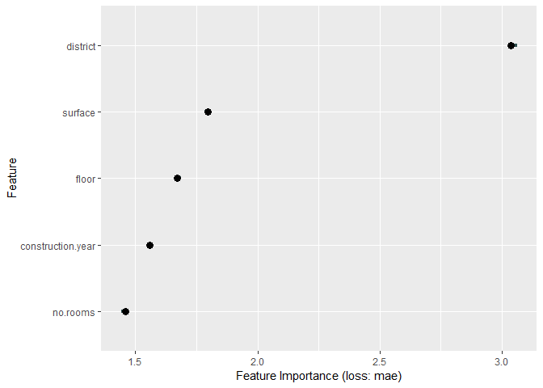
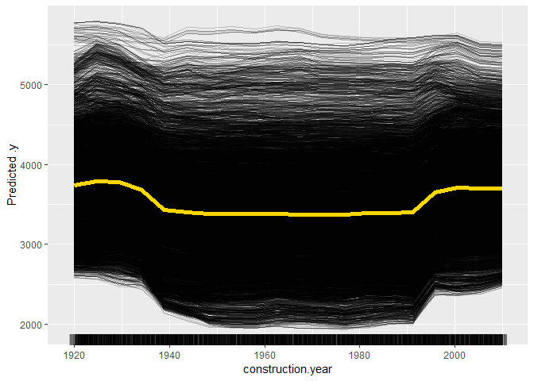
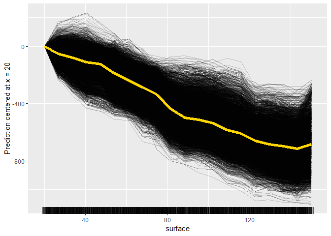

# read mlr models

regression task for apartments dataset.


```r
tuned.model <- readRDS("./tuned_models.RDS")
# tuned.model %>% str(2)
```


# iml + mlr

according to:

https://www.r-bloggers.com/interpretable-machine-learning-with-iml-and-mlr/


# build predictor

## simple


```r
require("iml")
# X = Boston[which(names(Boston) != "medv")]
require(DALEX)
```

```
Loading required package: DALEX
```

```
Welcome to DALEX (version: 0.2.6).
```

```

Attaching package: 'DALEX'
```

```
The following object is masked from 'package:dplyr':

    explain
```

```r
data("apartmentsTest", package = "DALEX")
X = apartmentsTest %>% select(-m2.price)
Y = apartmentsTest$m2.price

predictor.rf <- Predictor$new(tuned.model[["rf"]], data = X, y = Y)
```


## multiple predictor


```r
model.labels <- names(tuned.model)
predictor    <- list()

for(model.name in model.labels){
  predictor[[model.name]] <- Predictor$new(tuned.model[[model.name]], data = X, y = Y)
}
```


# Feature importance

We can measure how important each feature was for the predictions with FeatureImp. The feature importance measure works by shuffling each feature and measuring how much the performance drops. For this regression task we choose to measure the loss in performance with the mean absolute error (ÅemaeÅf); another choice would be the mean squared error (ÅemseÅf).

Allowed losses are: "ce", "f1", "logLoss", "mae", "mse", "rmse", "mape", "mdae", "msle", "percent_bias", "rae", "rmse", "rmsle", "rse", "rrse", "smape"

## simple


```r
imp <- FeatureImp$new(predictor.rf, loss = "mae")
plot(imp)
```

<!-- -->

```r
print(imp)
```

```
Interpretation method:  FeatureImp 
error function: mae

Analysed predictor: 
Prediction task: regression 


Analysed data:
Sampling from data.frame with 9000 rows and 5 columns.

Head of results:
            feature importance.05 importance importance.95
1          district      3.028381   3.034842      3.061762
2           surface      1.784823   1.795614      1.808137
3             floor      1.659259   1.669420      1.688189
4 construction.year      1.554792   1.557711      1.565035
5          no.rooms      1.441169   1.458128      1.461601
  permutation.error
1          642.0288
2          379.8669
3          353.1703
4          329.5378
5          308.4708
```
# Partial dependence

Besides learning which features were important, we are interested in how the features influence the predicted outcome. The Partial class implements partial dependence plots and individual conditional expectation curves. Each individual line represents the predictions (y-axis) for one data point when we change one of the features (e.g. ÅelstatÅf on the x-axis). The highlighted line is the point-wise average of the individual lines and equals the partial dependence plot. The marks on the x-axis indicates the distribution of the ÅelstatÅf feature, showing how relevant a region is for interpretation (little or no points mean that we should not over-interpret this region).


```r
pdp.obj <- Partial$new(predictor.rf, feature = "construction.year")
plot(pdp.obj)
```

<!-- -->

```r
pdp.obj$set.feature("surface")
pdp.obj$center(min(apartmentsTest$surface))
plot(pdp.obj)
```

<!-- -->

